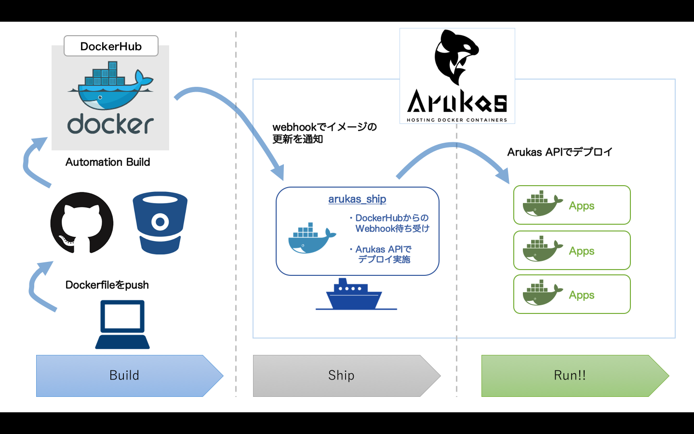
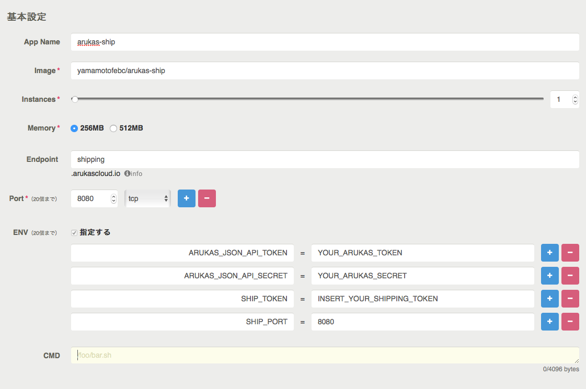
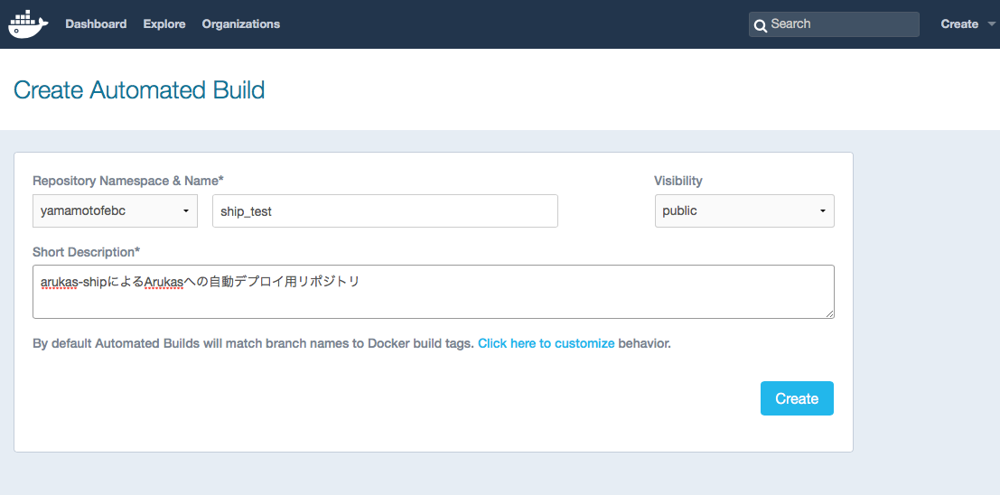
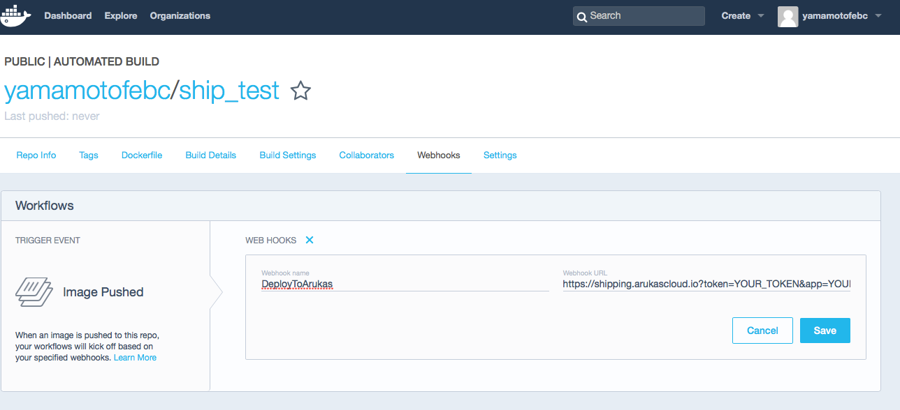

# aruas-ship

DockerHub & Arukas 連携Webhook アダプター

関連記事：[Qiita:arukas-shipでプルリク駆動デリバリー](http://qiita.com/yamamoto-febc/items/135344bee0d2d5edf412)

## 概要

[DockerHub](https://hub.docker.com/)へのDockerイメージpush時に送信できるWebhookを利用して
[Arukas](https://arukas.io)へのDockerコンテナのデプロイを行います。

Dockerのコンセプトである`Build, Ship, and Run Any App, Anywhere`のうち、`Ship`を担当するものです。

 * Build : 手元のマシン(開発時)、DockerHub(デプロイ時)
 * Ship : `arukas-ship`
 * Run : Arukas

`arukas-ship`を用いることで、手元のマシンで開発/テストしたDockerfileなどをGithub/Bitbucketへpushすれば
DockerHubでビルド(Build)、`arukas-ship`でArukasへデプロイ(Ship)、Arukasで実行(Run)出来るようになります。

## セットアップ/実行

### 1) Arukas上で`arukas-ship`コンテナ起動

DockerHubからのWebHookを待ち受けるためのコンテナを起動します。
あらかじめArukas APIキーを取得しておいてください。

Arukas コントロールパネルから新しいアプリケーションを作成します。

各項目は以下のように入力してください。

|項目名 | 入力内容 |
|----------|------------------------------|
|App Name|任意 |
|Image | `yamamotofebc/arukas-ship` |
|Instance | 任意(`1`〜`10`) |
|Memory | 任意(`256` or `512`) |
|Endpoint | 任意(ただし`.arukascloud.io`上で一意でないと登録できない)|
|Port | `8080`(下記の`SHIP_PORT`と同じ値を設定する) |
|Env | [下記](#Envに登録する値)の4つを登録 |
|Cmd| なし |

#### Envに登録する値

- `ARUKAS_JSON_API_TOKEN` : Arukas APIトークン
- `ARUKAS_JSON_API_SECRET` : Arukas APIシークレット
- `SHIP_TOKEN` : 任意のランダムな文字列
- `SHIP_PORT` : 8080

`SHIP_TOKEN`はDockerHubからのWebHook登録時の認証用です。
WebHookのURLにここで指定したトークンを含めることで認証を行っています。
任意の十分に長いランダムな文字列を指定してください。

#### Endpointの確認

Arukas上でコンテナを起動したらEndpointのURLを控えておきます。

### 2-1) DockerHubへAutomation Buildリポジトリ追加

DockerHubでAutomation Buildリポジトリを追加します。

### 2-2) WebHookの設定

WebHookの設定を行います。

WebHook URLは以下のように設定します。

    [控えておいたEndpointのURL]?token=[SHIP_TOKENに設定した文字列]&app=[任意のアプリケーション名]

例： `https://shipping.arukascloud.io?token=YOUR_SHIP_TOKEN&app=TestApplication`

`app`パラメータに指定した名前でArukas上にデプロイが行われます。

### 3) 実行(git push)

あとはAutomation Buildの設定をおこなっているGitリポジトリにPushすれば
自動でArukasへのデプロイが行われます。

すでにArukasへデプロイ済みのコンテナの場合は更新が行われます。

## License

  This project is published under [Apache 2.0 License](LICENSE).

## Author

  * Kazumichi Yamamoto ([@yamamoto-febc](https://github.com/yamamoto-febc))

